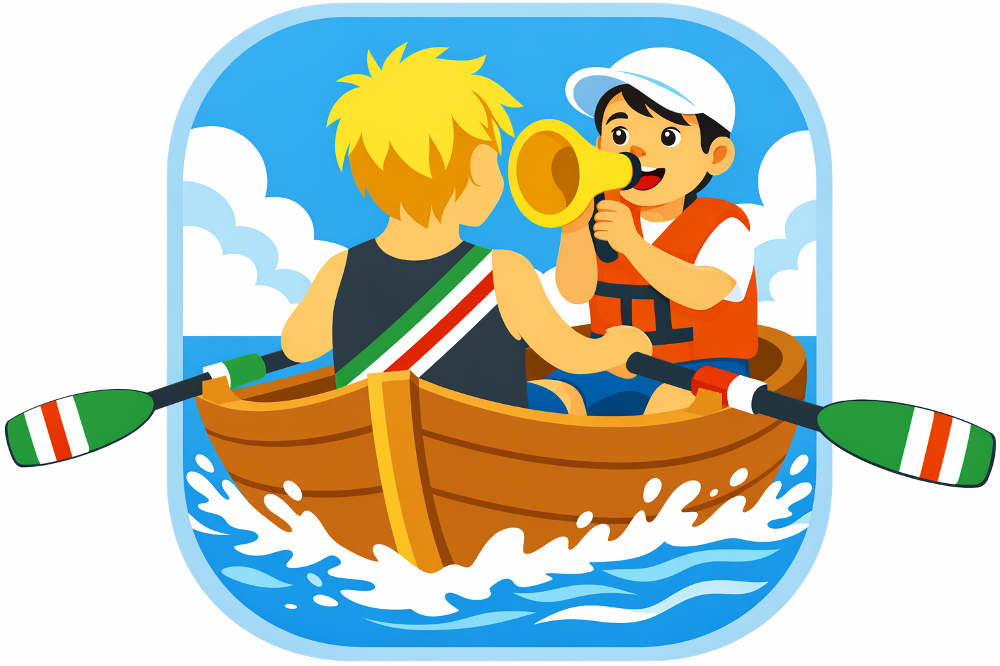
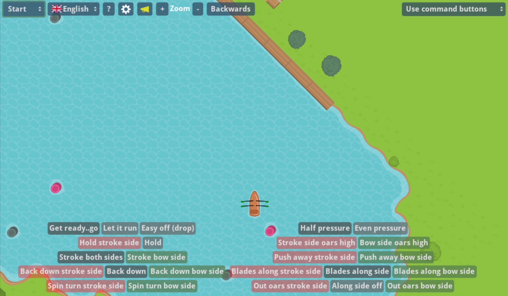

# App to practice (coxing) commands for rowing
## (App voor het oefenen van roei stuur commando's) 

Serious game to practice rowing coxing commands. This app is used by rowing club Viking in Utrecht to practice rowing commands for the steering instruction level 1. The app can be configured to also work for other rowing clubs.

The website:
[https://www.vangulik.org/PracticeRowingCommands/](https://www.vangulik.org/PracticeRowingCommands)

# License

[License](LICENSE)

# Privacy

[Privacy](PRIVACY.md)

# Change log

[Change log ](https://github.com/tijmenvangulik/PracticeRowingCommands/commits/main/)

# Development

Written in godot (3.5.0, https://godotengine.org)

To build a release:
* run npm install in the root
* open the godot project in the src folder (note: do not do an import, this will result into corrupted images)
* export all from godot (release)
* run the npm build script
* The bin/html folder contains the game ready for release

The default language is dutch. Most commands are translated to English. You can improve or add a translation by editing the  Translations.csv file.
The translations can be found [here](/src/translations/Translations.csv) This is a csv file which you can load in a spread sheet. You can send the translated version to me.
To make a short cut for a button in the resources you can extend the command name with:
* [commandname]_tooltip (long tooltips when tooltips are actie)
* [commandname]_shorttooltip (short tooltips always shown)
* [commandname]_buttonOnly (show text the the button)
* [commandname]_shortcut (a single character for a short cut)

You can also define a button set in this file for each language.

Possible localization codes:
[locals](https://docs.godotengine.org/en/3.5/tutorials/i18n/locales.html)

Some help needed translating the app to different languages and rowing club slang.

Press f1 in the game for debug mode

The first version was written in [scratch](https://scratch.mit.edu/projects/578632637/)

Some highlights
* Physics engine is used to simulate the boat movement
* Easy to add new rules sets from code. Default rules set can be configured in the translation.csv file
* User defined buttons sets and default button sets in the translation file.

# Self hosting
To self host the app download the  file and extract the files in a folder on your website. The app is mostly a static web app which does not require server interaction. There are two features in the app which require a server: The high scores and the feedback feature. The app will use my own server for these features. For communication with my server you need security codes which are not included in the source code. When my server is down or you do not want to use these features just ignore them ore remove it from the code. 

In the zip file there is also an index.wasm.br file. This is not a required but this is a brotli compressed file of the wasm file. When you enable brotli compression on your web server this file can speed up downloading the app.

## Self hosting a server for data storage
It is not required to host the server for data storage. All data is send to my server on ergometer-space.org. If you want to store all the data on your own server you can build the server project:
[Server project](Server/README.md)

# Thank you 

* Godot for the free user friendly game engine [link](https://godotengine.org/)
* Kenny for such a good tile set [link](https://www.kenney.nl/assets/rpg-base)
* Reinder for the button set and testing

