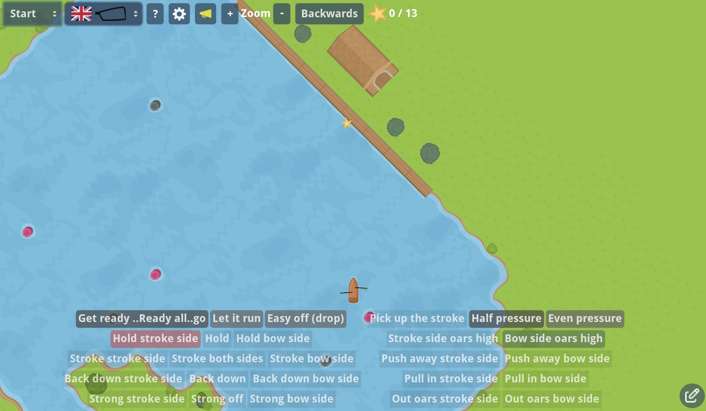

# App to practice Rowing (coxing) commands
## (App voor het Oefenen roeien stuur commando's)

Serious game to practice rowing coxing commands. 

The website:
[https://ergometer-space.org/PracticeRowingCommands](https://ergometer-space.org/PracticeRowingCommands)

Written in godot

The current language is still dutch but more language will be Edit the translations Translations.cv to add more languages or rowing club specific commands.
The translations can be found [here](/src/translations/Translations.csv) This is a csv file which you can load in a spread sheet. You can send the translated version to me.
You can also define a button set in this file for each language.

Some help needed translating the app to different languages and rowing club slang.

Press f1 in the game for debug mode

The first version was written in [scratch](https://scratch.mit.edu/projects/578632637/)

Some highlights
* Physics engine is used to simulate the boat movement
* Easy to add new rules sets from code. Default rules set can be configured in the translation.csv file
* User defined buttons sets and default button sets in the translation file.

